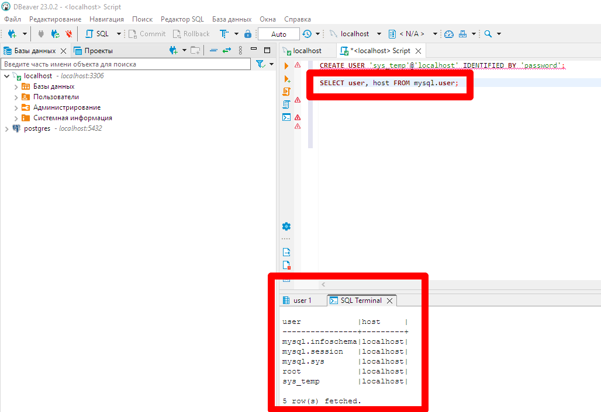

# Домашнее задание к занятию «Работа с данными (DDL/DML)» Андрей Дёмин


Задание можно выполнить как в любом IDE, так и в командной строке.

### Задание 1
1.1. Поднимите чистый инстанс MySQL версии 8.0+. Можно использовать локальный сервер или контейнер Docker.


1.2. Создайте учётную запись sys_temp. 
```
CREATE USER 'sys_temp'@'localhost' IDENTIFIED BY 'password';
```


1.3. Выполните запрос на получение списка пользователей в базе данных. (скриншот)
```
SELECT User, host FROM mysql.user;
```


1.4. Дайте все права для пользователя sys_temp. 
```
GRANT ALL PRIVILEGES ON *.* TO 'sys_temp'@'localhost';
```


1.5. Выполните запрос на получение списка прав для пользователя sys_temp. (скриншот)
```
SHOW GRANTS FOR 'sys_temp'@'localhost';
```


1.6. Переподключитесь к базе данных от имени sys_temp.

Для смены типа аутентификации с sha2 используйте запрос: 
```sql
ALTER USER 'sys_test'@'localhost' IDENTIFIED WITH mysql_native_password BY 'password';
```


1.6. По ссылке https://downloads.mysql.com/docs/sakila-db.zip скачайте дамп базы данных.

1.7. Восстановите дамп в базу данных.
```
mysql> source J:\downloads\sakila-db\sakila-db\sakila-schema.sql
```

---


1.8. При работе в IDE сформируйте ER-диаграмму получившейся базы данных. При работе в командной строке используйте команду для получения всех таблиц базы данных. (скриншот)
```
SHOW full TABLES;
```

---


*Результатом работы должны быть скриншоты обозначенных заданий, а также простыня со всеми запросами.*


### Задание 2
Составьте таблицу, используя любой текстовый редактор или Excel, в которой должно быть два столбца: в первом должны быть названия таблиц восстановленной базы, во втором названия первичных ключей этих таблиц. Пример: (скриншот/текст)

<ins>Ответ</ins>:

Для получения данных из БД с ресурса
https://translated.turbopages.org/proxy_u/en-ru.ru.9282131b-64480fae-4cb12cf5-74722d776562/https/dataedo.com/kb/query/mysql/list-all-primary-keys-and-their-columns#toc_1  
взят скрипт и приведен к следующему содержанию:
```
select
    tab.table_name,
    sta.column_name
from information_schema.tables as tab
inner join information_schema.statistics as sta
        on sta.table_schema = tab.table_schema
        and sta.table_name = tab.table_name
        and sta.index_name = 'primary'
where tab.table_schema = 'sakila'
    and tab.table_type = 'BASE TABLE'
order by tab.table_name
```
в результате выполнения получен вывод из БД только таблиц, имеющих первичный ключ: 
```
Название таблицы | Название первичного ключа

actor        |actor_id    |
address      |address_id  |
category     |category_id |
city         |city_id     |
country      |country_id  |
customer     |customer_id |
film         |film_id     |
film_actor   |actor_id    |
film_actor   |film_id     |
film_category|film_id     |
film_category|category_id |
film_text    |film_id     |
inventory    |inventory_id|
language     |language_id |
payment      |payment_id  |
rental       |rental_id   |
staff        |staff_id    |
store        |store_id    |
```


## Дополнительные задания (со звёздочкой*)
Эти задания дополнительные, то есть не обязательные к выполнению, и никак не повлияют на получение вами зачёта по этому домашнему заданию. Вы можете их выполнить, если хотите глубже шире разобраться в материале.

### Задание 3*
3.1. Уберите у пользователя sys_temp права на внесение, изменение и удаление данных из базы sakila.

Для начала нужно предоставить все привилегии пользователю для этой конкретной БД:
```
GRANT ALL PRIVILEGES ON `sakila`.* TO 'sys_temp'@'localhost';
```


Затем проверяем привилегии пользователя для этой БД:
```
SHOW GRANTS FOR 'sys_temp'@'localhost';
```

---


После этого удаляем права на внесение, изменение и удаление данных из базы:

```
REVOKE INSERT, UPDATE, DELETE ON `sakila`.* FROM 'sys_temp'@'localhost';
```


3.2. Выполните запрос на получение списка прав для пользователя sys_temp. (скриншот)
```
SHOW GRANTS FOR 'sys_temp'@'localhost';
```
```
Grants for sys_temp@localhost                                                                                                                                                                                     |
------------------------------------------------------------------------------------------------------------------------------------------------------------------------------------------------------------------+
GRANT USAGE ON *.* TO `sys_temp`@`localhost`                                                                                                                                                                      |
GRANT SELECT, CREATE, DROP, REFERENCES, INDEX, ALTER, CREATE TEMPORARY TABLES, LOCK TABLES, EXECUTE, CREATE VIEW, SHOW VIEW, CREATE ROUTINE, ALTER ROUTINE, EVENT, TRIGGER ON `sakila`.* TO `sys_temp`@`localhost`|

2 row(s) fetched.
```

---


*Результатом работы должны быть скриншоты обозначенных заданий, а также простыня со всеми запросами.*
